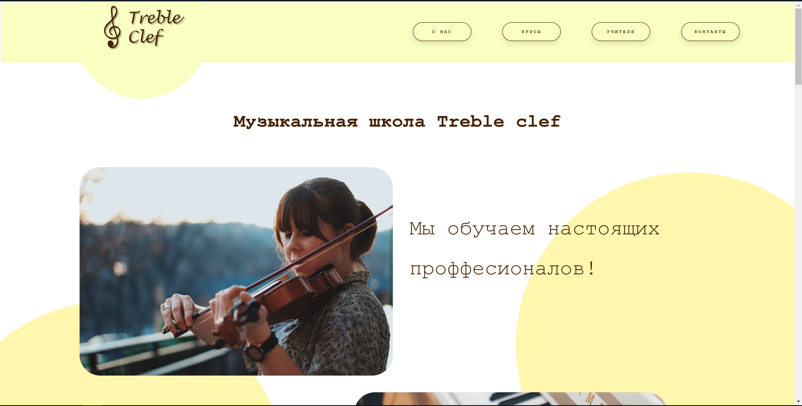
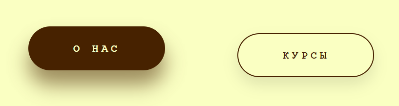
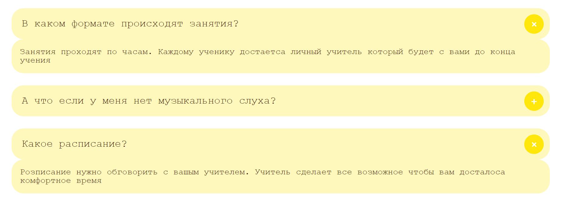
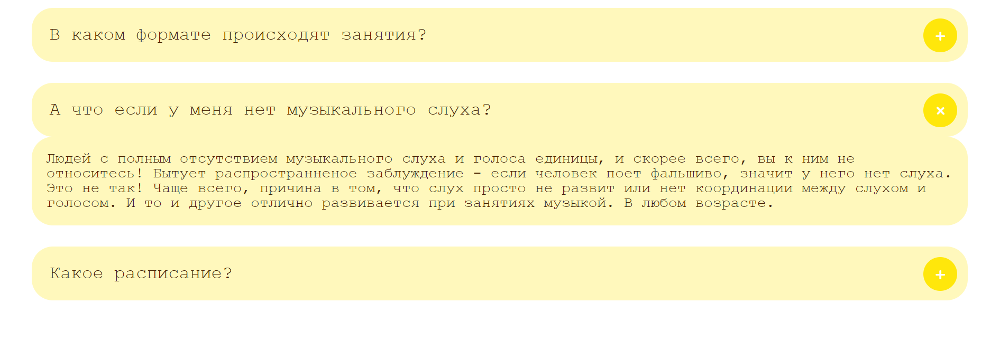

# Treble-Cheff-site
---
Фріланс проект, ціль - зверстати сайт за 1 день.
Було використано HTML із методами BEM та SCSS.
Сайт виконаний у світлих тонах із контрастним коричневим текстом
та анімацією на кнопках
Сторінка яка нас зустрічає при вході на сайт

Анімація при наведенні на кнопках:

із особливостей є випадаючі повідомлення створені на чистому CSS

Сайт створений без використання JS
